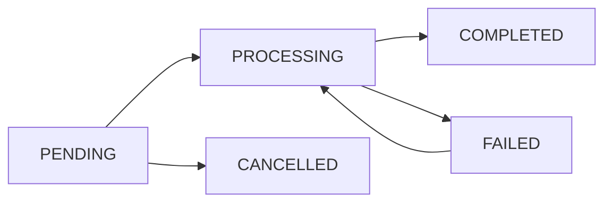

# Reporting System

## Overview

The JCTC Reporting System provides comprehensive automated report generation capabilities for cases, evidence, compliance monitoring, and executive summaries. The system supports multiple export formats and includes background processing for large reports.

## Features

### Report Types

1. **Case Summary Reports**
   - Comprehensive case overview with evidence and parties
   - Timeline of case activities
   - Configurable sections (evidence, parties, timeline)
   - Supports PDF, Word, Excel formats

2. **Evidence Chain of Custody Reports**
   - Complete chain of custody documentation
   - Integrity verification records
   - File hashes and metadata
   - Custody log with timestamps and actions

3. **Compliance Reports**
   - SLA performance metrics
   - Audit violations and resolutions
   - Compliance score calculations
   - Trend analysis and recommendations

4. **Executive Summary Reports**
   - High-level KPIs and metrics
   - Performance trends and insights
   - Key highlights and concerns
   - Strategic recommendations

5. **Custom Reports**
   - User-defined data sources and filters
   - Flexible chart configurations
   - Custom grouping and sorting
   - Multiple visualization options

## API Endpoints

### Report Generation

#### Generate Report
```http
POST /api/v1/reports/generate
Content-Type: application/json

{
  "report_type": "case_summary",
  "format": "pdf",
  "parameters": {
    "case_id": "case-123",
    "include_evidence": true,
    "include_parties": true
  },
  "priority": "normal",
  "notify_on_completion": true
}
```

#### Get Report Status
```http
GET /api/v1/reports/{report_id}
```

#### Download Report
```http
GET /api/v1/reports/{report_id}/download
```

### Specialized Reports

#### Case Summary Report
```http
POST /api/v1/reports/case-summary?case_id=case-123&format=pdf&include_evidence=true
```

#### Evidence Chain Report
```http
POST /api/v1/reports/evidence-chain?evidence_id=evidence-456&format=pdf
```

#### Compliance Report
```http
POST /api/v1/reports/compliance?report_period=monthly&format=excel
```

#### Executive Summary
```http
POST /api/v1/reports/executive-summary?report_period=quarterly&format=pdf
```

### Report Management

#### List Reports
```http
GET /api/v1/reports/?report_type=case_summary&status=COMPLETED&limit=20
```

#### Delete Report
```http
DELETE /api/v1/reports/{report_id}
```

#### List Templates
```http
GET /api/v1/reports/templates/?category=case_reports
```

#### Export Formats
```http
GET /api/v1/reports/exports/formats
```

## Report Formats

### Supported Formats

| Format | Description | Use Case | Features |
|--------|-------------|----------|----------|
| **PDF** | Portable Document Format | Official documentation, archiving | Charts, images, tables, professional layout |
| **Word** | Microsoft Word Document | Collaborative editing, reviews | Editable, charts, images, comments |
| **Excel** | Microsoft Excel Spreadsheet | Data analysis, calculations | Multiple sheets, formulas, charts |
| **HTML** | Web Document | Online viewing, sharing | Interactive, responsive, web-friendly |

### Format Capabilities

```json
{
  "pdf": {
    "supports_charts": true,
    "supports_images": true,
    "supports_tables": true,
    "max_pages": 1000
  },
  "word": {
    "supports_charts": true,
    "supports_images": true,
    "supports_tables": true,
    "max_pages": 500
  },
  "excel": {
    "supports_charts": true,
    "supports_images": false,
    "supports_tables": true,
    "max_rows": 1000000
  }
}
```

## Permission System

### Role-Based Access

| Role | Case Reports | Evidence Reports | Compliance Reports | Executive Summary |
|------|-------------|-----------------|-------------------|------------------|
| **Admin** | ✅ All | ✅ All | ✅ Generate | ✅ Generate |
| **Supervisor** | ✅ Department | ✅ Department | ✅ Generate | ✅ Generate |
| **Investigator** | ✅ Assigned | ✅ Assigned | ❌ View Only | ❌ View Only |
| **Prosecutor** | ✅ Assigned | ✅ Assigned | ❌ View Only | ❌ View Only |
| **Forensic** | ✅ Assigned | ✅ Generate | ❌ View Only | ❌ View Only |
| **Intake** | ✅ Assigned | ❌ View Only | ❌ No Access | ❌ No Access |
| **Liaison** | ✅ Assigned | ✅ View Only | ❌ View Only | ❌ View Only |

### Data Scope

- **Own**: User can only generate reports for cases they are assigned to
- **Team**: User can generate reports for their team's cases
- **Department**: User can generate reports for their department
- **All**: User can generate reports for all cases (Admin/Supervisor only)

## Background Processing

### Queue System

Reports are processed using FastAPI's BackgroundTasks for non-blocking execution:

1. **Request Submission**: Report request is validated and queued
2. **Status Tracking**: Real-time status updates (PENDING → PROCESSING → COMPLETED)
3. **Progress Updates**: Percentage completion for large reports
4. **Error Handling**: Comprehensive error logging and retry logic
5. **Notification**: Optional email/SMS notifications on completion

### Status Flow



## Report Templates

### Template System

Templates provide standardized formatting and content structure:

- **System Templates**: Pre-defined templates for common report types
- **Custom Templates**: User-created templates with specific formatting
- **Template Fields**: Configurable sections and data fields
- **Template Inheritance**: Base templates with customizable sections

### Available Templates

1. **Standard Case Summary**
   - Case overview, evidence summary, party information, timeline
   - Professional PDF layout with JCTC branding

2. **Chain of Custody Report**
   - Evidence details, custody log, integrity verification
   - Legal-compliant format for court proceedings

3. **Monthly Compliance Report**
   - Metrics summary, violations, recommendations, trends
   - Executive dashboard format with charts

## Data Models

### Report Schema

```python
class ReportRequest(BaseModel):
    report_type: ReportType
    format: ReportFormat = ReportFormat.PDF
    parameters: Dict[str, Any] = {}
    template_id: Optional[str] = None
    priority: ReportPriority = ReportPriority.NORMAL
    notify_on_completion: bool = True

class ReportResponse(BaseModel):
    id: str
    report_type: ReportType
    format: ReportFormat
    status: ReportStatus
    download_url: Optional[str] = None
    file_size: Optional[int] = None
    progress_percentage: Optional[int] = 0
    estimated_completion: Optional[datetime] = None
    created_at: datetime
```

### Database Models

- **Report**: Generated reports with metadata and file information
- **ReportTemplate**: Template definitions and configurations
- **ReportExecution**: Execution history and performance tracking
- **ReportPermission**: Role-based access control settings
- **ReportAnalytics**: Usage statistics and performance metrics

## Integration Examples

### Generate Case Summary

```python
import requests

# Login and get token
login_response = requests.post(
    "http://localhost:8000/api/v1/auth/login",
    json={
        "email": "investigator@jctc.gov.ng",
        "password": "investigator123"
    }
)
token = login_response.json()["access_token"]

# Generate case summary report
response = requests.post(
    "http://localhost:8000/api/v1/reports/case-summary",
    params={
        "case_id": "case-123",
        "format": "pdf",
        "include_evidence": True,
        "include_parties": True,
        "include_timeline": True
    },
    headers={"Authorization": f"Bearer {token}"}
)

report_id = response.json()["id"]
print(f"Report queued with ID: {report_id}")
```

### Check Report Status

```python
# Check status
status_response = requests.get(
    f"http://localhost:8000/api/v1/reports/{report_id}",
    headers={"Authorization": f"Bearer {token}"}
)

status = status_response.json()
print(f"Status: {status['status']}, Progress: {status['progress_percentage']}%")

if status["status"] == "COMPLETED":
    download_url = status["download_url"]
    print(f"Download: {download_url}")
```

### Generate Compliance Report

```python
# Generate monthly compliance report
response = requests.post(
    "http://localhost:8000/api/v1/reports/compliance",
    params={
        "report_period": "monthly",
        "format": "excel",
        "include_metrics": True,
        "include_violations": True,
        "include_recommendations": True
    },
    headers={"Authorization": f"Bearer {token}"}
)
```

## Error Handling

### Common Errors

| Error Code | Description | Resolution |
|------------|-------------|------------|
| `400` | Invalid report parameters | Check required parameters for report type |
| `403` | Insufficient permissions | Verify user role has access to report type |
| `404` | Report/Resource not found | Check report ID or resource exists |
| `429` | Rate limit exceeded | Wait before making additional requests |
| `500` | Report generation failed | Check logs for detailed error information |

### Error Response Format

```json
{
  "detail": "Case not found",
  "error_code": "CASE_NOT_FOUND",
  "error_details": {
    "case_id": "invalid-case-123",
    "message": "The specified case ID does not exist or you don't have access"
  }
}
```

## Performance Considerations

### Optimization Strategies

1. **Background Processing**: Large reports are processed asynchronously
2. **Caching**: Frequently accessed data is cached for faster generation
3. **Pagination**: Large datasets are processed in chunks
4. **Format Selection**: Choose appropriate format for use case
5. **Template Optimization**: Use efficient templates for faster generation

### Expected Generation Times

| Report Type | Small Dataset | Medium Dataset | Large Dataset |
|-------------|---------------|----------------|---------------|
| Case Summary | 30 seconds | 1-2 minutes | 3-5 minutes |
| Evidence Chain | 20 seconds | 45 seconds | 1-2 minutes |
| Compliance | 1 minute | 2-3 minutes | 5-10 minutes |
| Executive Summary | 45 seconds | 2 minutes | 4-8 minutes |
| Custom Report | 1-2 minutes | 3-5 minutes | 10-15 minutes |

## File Structure

```
app/
├── api/
│   └── reports.py              # Report API endpoints
├── models/
│   └── reports.py              # Database models
├── schemas/
│   └── reports.py              # Pydantic schemas
├── utils/
│   └── reports.py              # Report generation utilities
```

## Dependencies

### Required Libraries

```python
# Report Generation
reportlab>=3.6.0              # PDF generation
python-docx>=0.8.11           # Word document generation
openpyxl>=3.1.0               # Excel file generation
pandas>=1.5.0                 # Data manipulation
matplotlib>=3.6.0             # Chart generation
seaborn>=0.12.0               # Statistical visualization

# Background Processing
celery>=5.3.0                 # Task queue (optional)
redis>=4.5.0                  # Task broker (optional)
```

### Installation

```bash
# Install report generation dependencies
uv pip install reportlab python-docx openpyxl pandas matplotlib seaborn

# For production with Celery
uv pip install celery redis
```

## Future Enhancements

### Planned Features

1. **Scheduled Reports**: Automated recurring report generation
2. **Report Sharing**: Share reports with external users via secure links
3. **Advanced Analytics**: Machine learning insights and predictions
4. **Custom Visualizations**: Interactive charts and dashboards
5. **Report Collaboration**: Comments and annotations on reports
6. **API Integration**: Export reports to external systems
7. **Mobile Optimization**: Mobile-friendly report formats
8. **Multi-language Support**: Reports in multiple languages

### Phase 3 Roadmap

- **Q1**: Scheduled reporting and advanced templates
- **Q2**: Report sharing and collaboration features
- **Q3**: Advanced analytics and ML insights
- **Q4**: Mobile optimization and multi-language support